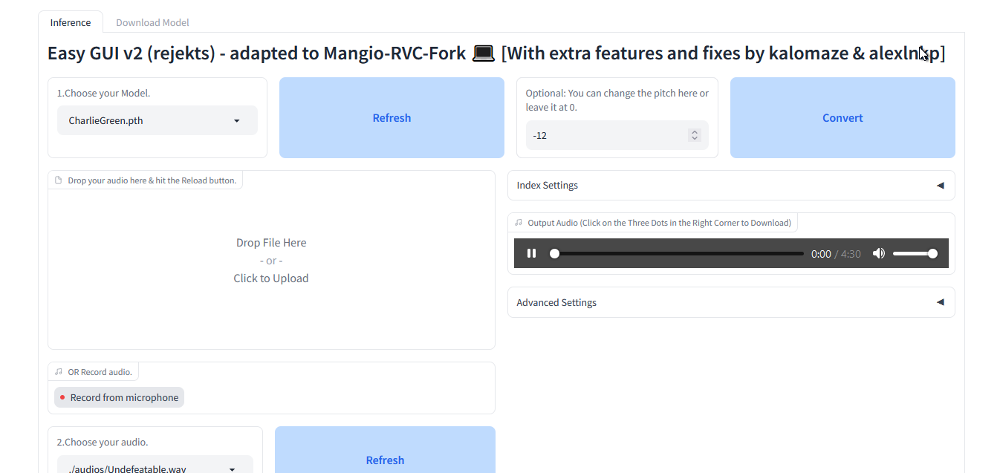

<h1>EASYGUI  RVC updated V2 💻 </h1>
A fork of an easy-to-use SVC framework based on VITS with top1 retrieval 💯. In general, this fork provides a CLI interface in addition. And also gives you more f0 methods to use, as well as a personlized 'hybrid' f0 estimation method using nanmedian.   
<b> 

 
  

> 💓 Please support the original [RVC repository](https://www.bilibili.com/video/BV1pm4y1z7Gm/). Without it, obviously this fork wouldn't have been possible. The Mangio-RVC-Fork aims to essentially enhance the features that the original RVC repo has in my own way. Please note that this fork is NOT STABLE and was forked with the intention of experimentation. Do not use this Fork thinking it is a "better" version of the original repo. Think of it more like another "version" of the original repo. Please note that this doesn't have a google colab. If you want to use google colab, go to the original repository. This fork is intended to be used with paperspace and local machines for now.
</b>

<b> Now supports version 2 pre-trained models! </b>

## Add me on discord: Funky Town#2048
I am able to communicate with you here and there.

  

Special thanks to discord user @kalomaze#2983 for creating a temporary colab notebook for this fork for the time being. Eventually, an official, more stable notebook will be included with this fork. Please use paperspace instead if you can as it is much more stable.
 

------

> The original RVC [Demo Video](https://www.bilibili.com/video/BV1pm4y1z7Gm/) here!

> Realtime Voice Conversion Software using RVC : [w-okada/voice-changer](https://github.com/w-okada/voice-changer)

> The dataset for the pre-training model uses nearly 50 hours of high quality VCTK open source dataset.

## Credits
+ [ContentVec](https://github.com/auspicious3000/contentvec/)
+ [VITS](https://github.com/jaywalnut310/vits)
+ [HIFIGAN](https://github.com/jik876/hifi-gan)
+ [Gradio](https://github.com/gradio-app/gradio)
+ [FFmpeg](https://github.com/FFmpeg/FFmpeg)
+ [Ultimate Vocal Remover](https://github.com/Anjok07/ultimatevocalremovergui)
+ [audio-slicer](https://github.com/openvpi/audio-slicer)
## Thanks to all contributors for their efforts

